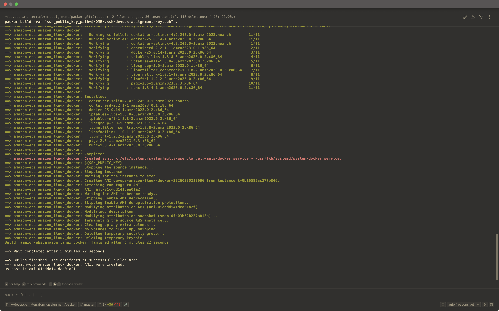
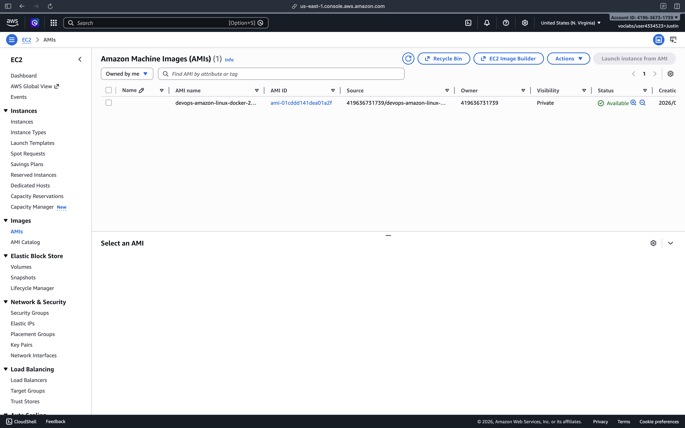
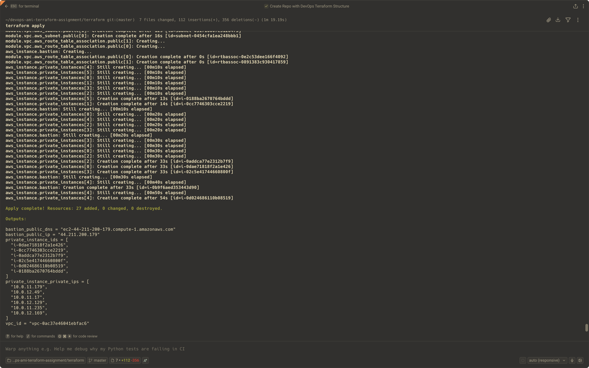
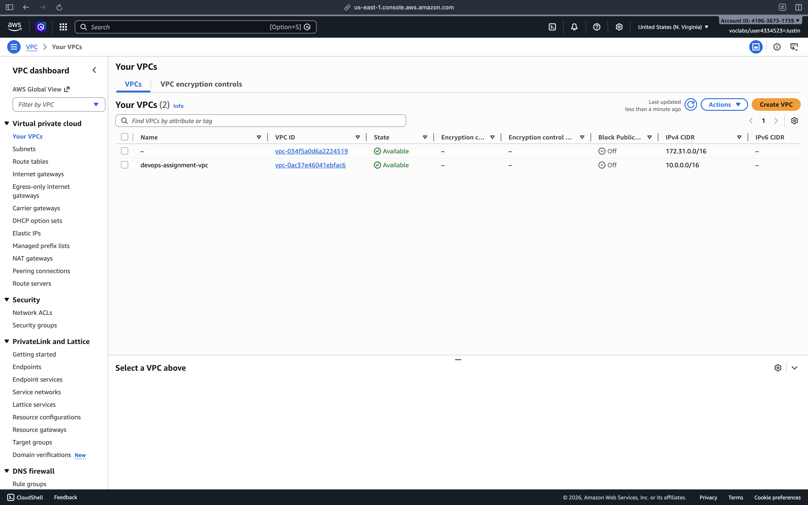
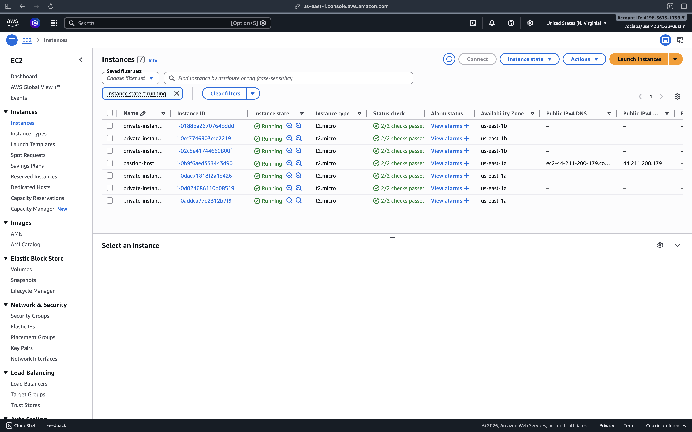
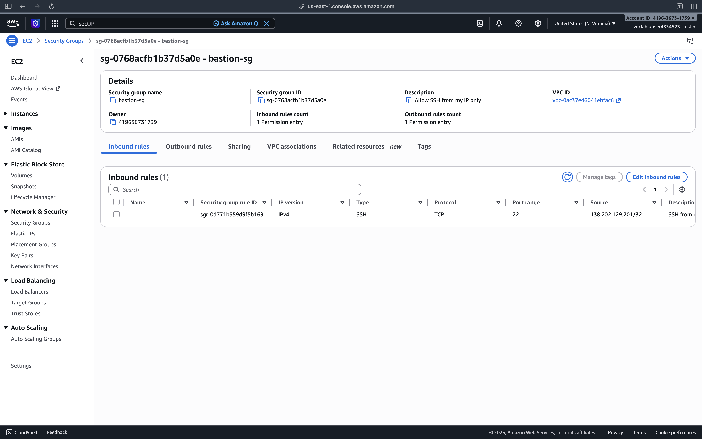
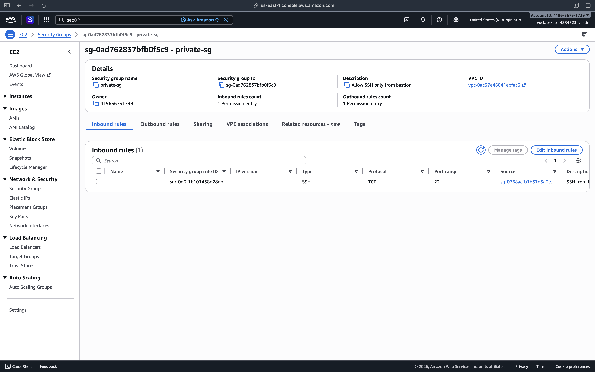
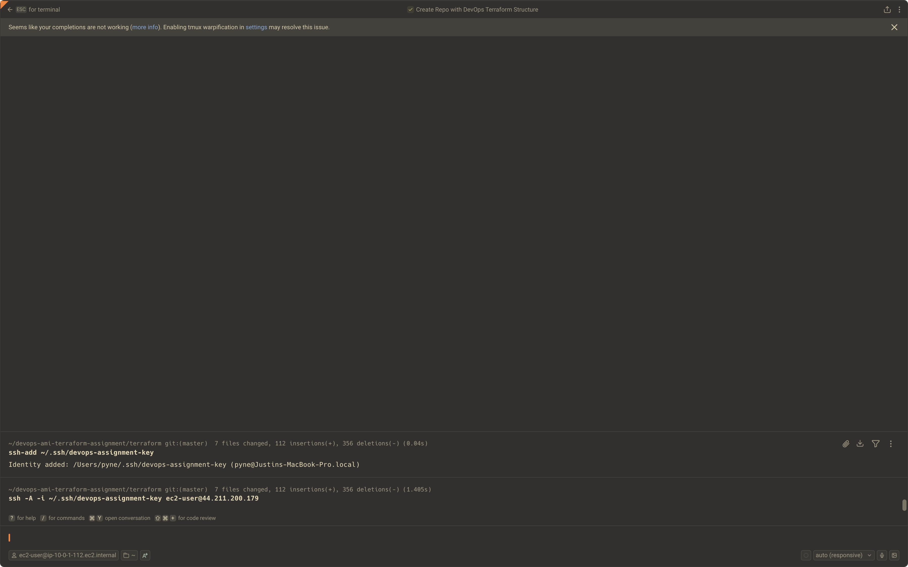
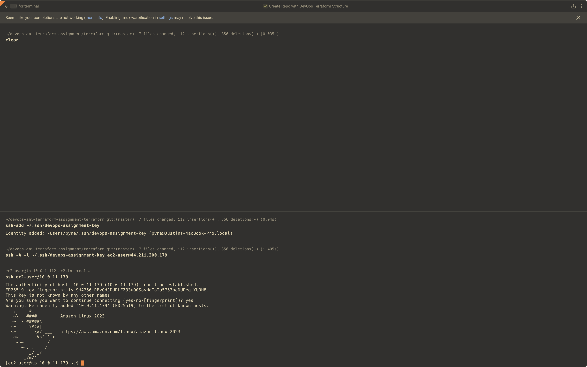

# DevOps Assignment - Packer + Terraform

## What I Built

### Part A - Custom AMI with Packer
I created a custom Amazon Linux AMI using Packer. The AMI includes Docker and my SSH public key.

### Part B - Infrastructure with Terraform
Using Terraform, I provisioned:
- 1 VPC
- Public and private subnets
- 1 bastion host in the public subnet
- 6 EC2 instances in the private subnets
- Security groups so that:
  - the bastion only accepts SSH from my IP
  - the private instances only accept SSH from the bastion

---

## Files in This Project

- `packer/` - Packer files used to build the custom AMI
- `terraform/` - Terraform files used to provision the infrastructure
- `README.md` - This file
- `screenshots/` - Screenshots showing the completed assignment

---

## How I Ran the Project

### 1. Build the AMI with Packer
From the `packer` directory:

```bash
packer init .
packer validate -var "ssh_public_key_path=$HOME/.ssh/devops-assignment-key.pub" .
packer build -var "ssh_public_key_path=$HOME/.ssh/devops-assignment-key.pub" .
```

This created a custom AMI in AWS.

### 2. Provision infrastructure with Terraform
From the `terraform` directory:

```bash
terraform init
terraform validate
terraform plan
terraform apply
```

This created the VPC, subnets, bastion host, and 6 private instances.

---

## How to Connect

### Connect to the bastion host
```bash
ssh -i ~/.ssh/devops-assignment-key ec2-user@<bastion-public-ip>
```

### Connect from bastion to a private instance
I used SSH agent forwarding:

```bash
ssh-add ~/.ssh/devops-assignment-key
ssh -A -i ~/.ssh/devops-assignment-key ec2-user@<bastion-public-ip>
ssh ec2-user@<private-instance-ip>
```

This allowed me to connect to a private instance through the bastion host.

---

## What to Expect

After running the project:
- The custom AMI appears in EC2 > AMIs
- 1 bastion host is created in the public subnet
- 6 EC2 instances are created in private subnets
- Only the bastion has a public IP
- The private instances are reachable only through the bastion

---

## Screenshots

### Packer AMI Build Success


### AMI in AWS Console


### Terraform Apply Success


### VPC Created in AWS


### EC2 Instances Created by Terraform


### Bastion Security Group


### Private Instance Security Group


### SSH Agent Forwarding to Bastion


### SSH from Bastion to Private Instance


---

## Cleanup

To remove the resources:

```bash
terraform destroy
```
